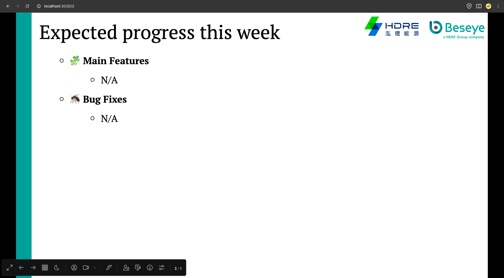

# Welcome to Beseye [Slidev](https://github.com/slidevjs/slidev) Template!

To start the slide show:

- 安裝依賴: `npm install`
- 啟動開發伺服器: `npm run dev`
- 在瀏覽器中訪問 <http://localhost:3030>
- 使用 <kbd>space</kbd> 或 <kbd>↓</kbd> 換頁
- 使用 <kbd>→</kbd> 或 <kbd>←</kbd> 的控制欄前往下 / 上一個動畫
- 滑鼠移動至左下角，可開啟控制欄

- 控制欄由右往左數第三個 icon，可以開啟所見即所得編輯器

- 編輯結束後，打開 command line，並輸入 `slidev export --output [檔案名稱].pdf`，即可輸出成 PDF

若想要輸出成 PDF, PNG, PPTX，可以參考 [Slidev Cli](https://sli.dev/builtin/cli)、[Slidev Export](https://sli.dev/guide/exporting)。

---

Learn more about Slidev at the [documentation](https://sli.dev/).
